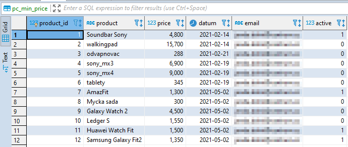
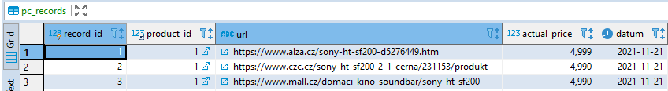
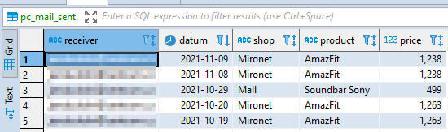

# PriceChecker

PriceChecker is a Python script, which checks products urls saved in a database and scrap their prices. If the scrapped price is lower than set price (limit price for buying) then the script sends email or notification to smartphone via Pushover app.

**Database**

There need to be 3 tables in the database for the python script.

**1) pc_min_price** 
Table pc_min_price contains all the products for which prices will be scrapped. Columns: 
a) product_id - unique product id (integer - auto increase) 
b) product - product name 
c) price - limit price when I want to buy (E.g. if the price is set to 1500 then I get a notification when a product price on a website is lower than 1500) 
d) datum - date of record insertion to the database 
e) email - email address for notification 
f) active - 1 - active (price will be scrapped), 0 - not active (price wont be scrapped)

**2) pc_records** 
Table pc_records contains product urls for individual eshop and their current price on the websites. Columns: 
a) record_id - unique record id 
b) product_id - product id, foreign key from pc_min_price 
c) url - product url for the particular eshop 
d) actual_price - the last scrapped price from the website 
f) datum - the last scrapping date 

**3) pc_mail_sent** 
Table pc_mail_sent contains records of all sent emails and notifications. Columns: 
a) receiver - receivers email address 
b) datum - notification/email sent date 
c) shop - eshop for which was notification sent 
d) product - product for which was notification sent 
f) price - product price on the eshop for which was notification sent 

